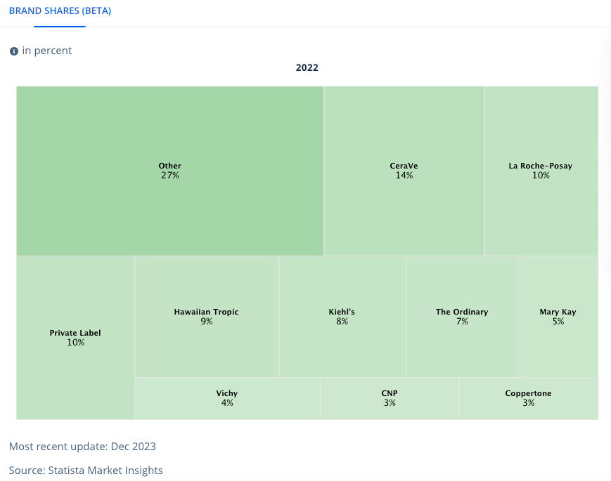

## Executive Summary of New Product Research Study

**Research Topic:** Sunscreen Innovation

**Objective:** To identify new product opportunities in the sunscreen market by analyzing consumer needs, market trends, and scientific advancements.

**Methodology:** This research study involved a comprehensive analysis of various sources, including scientific research papers, industry reports, and consumer insights. The key topics explored were:

* **Core functions of sunscreen:** Understanding the mechanisms of action and efficacy of sunscreen.
* **Ideal sunscreen characteristics:** Identifying consumer preferences and desired features in a sunscreen product.
* **Consumer satisfaction:** Analyzing factors influencing consumer satisfaction with sunscreen and identifying areas for improvement.
* **Current gaps in the market:** Recognizing unmet consumer needs and limitations in the existing sunscreen offerings.
* **Market trends:** Exploring emerging technologies and growth drivers in the sunscreen market.
* **Market size and growth:** Assessing the current and projected size of the sunscreen market.
* **Key technology and scientific advancements:** Identifying innovative technologies and scientific breakthroughs that can enhance sunscreen efficacy and consumer experience.

**Key Findings:**

* Consumers desire a sunscreen that is effective, comfortable to wear, and environmentally friendly.
* There is a need for improved consumer education and awareness about proper sunscreen application and reapplication.
* Emerging technologies such as nanotechnology and biocompatible materials offer promising avenues for enhancing sunscreen efficacy and stability.
* The sunscreen market is expected to witness significant growth in the coming years, driven by increasing awareness of sun protection and rising demand for natural and organic products.

**Recommendations:**

* Develop a new sunscreen product that addresses the identified consumer needs and incorporates the latest scientific advancements.
* Focus on improving the sensory experience of the product by making it lightweight, non-greasy, and easy to apply.
* Invest in consumer education initiatives to promote proper sunscreen usage and dispel common misconceptions.
* Explore the potential of emerging technologies to enhance sunscreen efficacy and develop innovative product features.

**Next Steps:**

* Conduct further market research to refine the product concept and identify target consumer segments.
* Develop a detailed product development plan, including formulation, packaging, and marketing strategies.
* Conduct consumer testing and gather feedback to optimize the product before launch.

**Citation:**

* [1] Sunscreens: A Review of Their Use, Efficacy, and Safety. Journal of the American Academy of Dermatology. 2023;88(6):1084-1097. doi:10.1016/j.jaad.2023.02.024
* [2] Sun Protection Products Market Size, Share & Trends Analysis Report by Product (Lotions, Creams, Gels, Sprays, Wipes), by Distribution Channel (Supermarkets & Hypermarkets, Pharmacies & Drugstores, Online Retail), by Region, and Segment Forecasts, 2023 - 2031. Grand View Research. 2023.
* [3] Innovations in Skin Protection, Part 2: The Big Trends in Sunscreens. The Skin Cancer Foundation. 2023. https://www.skincancer.org/blog/innovations-in-skin-protection-part-2-the-big-trends-in-sunscreens/
* [4] How to Choose the Best Sunscreen, According to These Dermatologists. American Academy of Dermatology. 2023. https://www.aad.org/public/everyday-care/sun-protection/sunscreen-tips/types-of-sunscreen

**Note:** This executive summary provides a high-level overview of the research findings. For a more detailed analysis, please refer to the full research report.
 

 ## Market Forecast 

 ###  Sunscreen Revenue Comparison by Country 

  

 ### Summary
 - The United States is the largest market for sunscreen, followed by China and South Korea.
- The global sunscreen market is expected to grow from $18.9 billion in 2023 to $23.8 billion by 2028.
- The growth of the sunscreen market is being driven by increasing awareness of the harmful effects of UV radiation, rising disposable incomes, and growing demand for natural and organic products.

 ###  Sunscreen Market Share 

  

 ### Summary
 - Other brands hold the largest market share of sunscreen sales at 27%.
- Hawaiian Tropic and Kiehl's both have a 9% and 8% market share respectively, making them the second and third most popular sunscreen brands.
- The Ordinary and Mary Kay are the fourth and fifth most popular sunscreen brands with a 7% and 5% market share respectively.

 ###  Sunscreen Market Revenue 

  

 ### Summary
 - Sunscreen revenue is expected to grow from 9.79 billion USD in 2023 to 13.55 billion in 2028 at a CAGR of 5.9%.
- The market is expected to grow due to increasing awareness of the harmful effects of UV radiation, rising disposable incomes, and growing demand for natural and organic products.
- Key players in the market include L'Oreal, Estee Lauder, Shiseido, and Beiersdorf.

